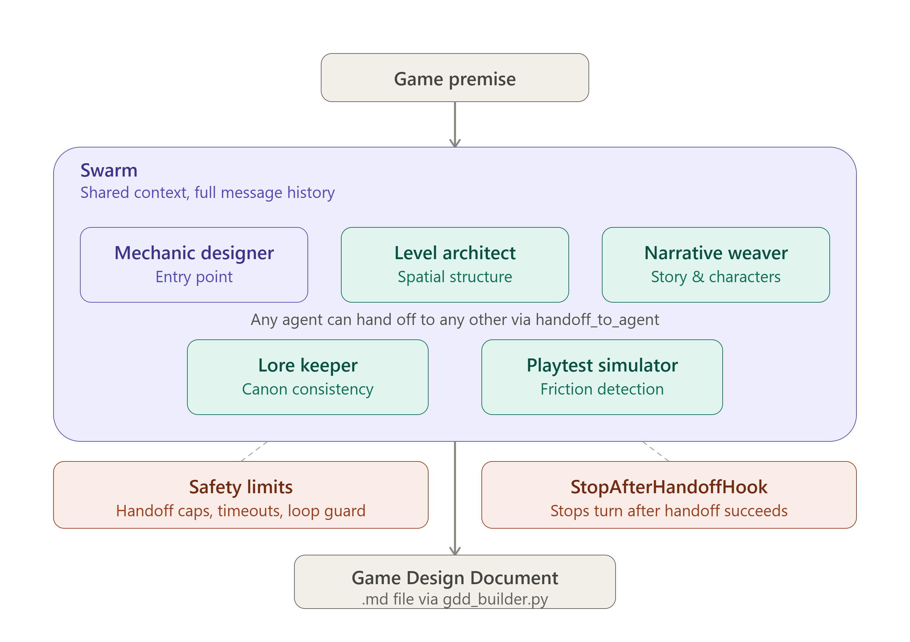

# Strands Agents - Patrón de Orquestación Swarm (Enjambre)


## Introducción

Este es un ejemplo educativo del patrón de orquestación **Swarm** (Enjambre) del framework [Strands Agents](https://strandsagents.com/). Swarm es un patrón de multi-agente donde no hay un orquestador central que decida el flujo: cada agente tiene acceso al contexto completo de la tarea, puede ver el trabajo de los agentes anteriores, y decide de forma autónoma cuándo transferir el control a otro agente mejor capacitado para continuar (*handoff*).
El objetivo es analizar su funcionamiento de manera local sin necesidad de hacer uso de AWS.


### ¿Cuándo usar Swarm?

- **La secuencia de pasos no se puede predefinir**: no sabés de antemano qué agente necesitará intervenir después, porque depende del contenido que se vaya generando.
- **Puede haber correcciones o retrocesos**: el problema requiere ciclos de ida y vuelta entre especialistas (ej. una decisión de un agente invalida el trabajo de otro), algo que un patrón secuencial como Workflow o uno de dependencias fijas como Graph no puede manejar sin haber anticipado ese ciclo explícitamente.
- **Hay múltiples dimensiones de expertise en tensión**: cada agente defiende una perspectiva distinta y el valor está justamente en que negocien entre sí, no en que trabajen en aislamiento.
- **Se necesita razonamiento colectivo emergente**: la solución final surge de la interacción entre agentes, no de que un solo agente (o un humano) coordine todo desde arriba.

❗ No es el patrón ideal cuando el flujo de trabajo es fijo y predecible (ahí conviene Workflow o Graph), ni cuando un solo agente con las herramientas adecuadas puede resolver la tarea sin necesidad de múltiples perspectivas especializadas.

La idea principal es mostrar como se puede estructurar y testear localmente por medio de Ollama con el pequeño modelo gemma4:e2b-it-qat o via la API de gemini, sin la necesidad de desplegar en AWS.

## Caso de Uso (game-design-swarm)

Co-crear un Game Design Document (GDD) a partir de una premisa (ej: "roguelike de cocina en un castillo maldito"), donde cada agente defiende una dimensión del juego.
En este ejemplo, cinco agentes especializados, cada uno responsable de una dimensión distinta del diseño de un videojuego (mecánicas, narrativa, niveles, lore y experiencia de juego) colaboran para transformar una premisa simple (por ejemplo, *"roguelike de cocina en un castillo maldito"*) en un **Game Design Document (GDD)** coherente. A diferencia de un pipeline lineal, los agentes pueden detectar fricciones entre sus decisiones (una mecánica que contradice la narrativa, una regla de lore que rompe el balance) y reabrir la conversación con el agente correspondiente hasta llegar a un resultado consistente.



### Topología de handoffs emergente (ejemplo):

```plaintext
[Entry point]
mechanic_designer ↔ level_architect
      ↓                  ↓
narrative_weaver ←→ lore_keeper
         ↓
   playtest_simulator
         │
         ├─→ [handoff a mechanic_designer / narrative_weaver /
         │     level_architect / lore_keeper si detecta fricción,
         │     máx. 1 objeción por elemento]
         │
         └─→ "VEREDICTO: SIN FRICCIÓN DETECTADA" → [fin del swarm, GDD listo para consolidar]
```


## Estructura de carpetas

 ```plaintext
strands-swarm/
├── README.md
├── requirements.txt
├── .env.example
├── .gitignore
│
├── src/
│   ├── __init__.py
│   ├── main.py                  # entry point, builds and runs the swarm
│   ├── config.py                # model provider config, timeouts, swarm limits
│   │
│   ├── agents/
│   │   ├── __init__.py
│   │   ├── _common.py           # shared model factory + prompt loader
│   │   ├── _hooks.py            # StopAfterHandoffHook
│   │   ├── mechanic_designer.py
│   │   ├── narrative_weaver.py
│   │   ├── level_architect.py
│   │   ├── lore_keeper.py
│   │   └── playtest_simulator.py
│   │
│   ├── prompts/
│   │   ├── mechanic_designer.md
│   │   ├── narrative_weaver.md
│   │   ├── level_architect.md
│   │   ├── lore_keeper.md
│   │   └── playtest_simulator.md
│   │
│   ├── swarm/
│   │   ├── __init__.py
│   │   └── build_swarm.py       # instantiates agents + configures Swarm (max_handoffs, etc.)
│   │
│   └── output/
│       ├── __init__.py
│       └── gdd_builder.py       # consolidates node_history/results into the final GDD
│
├── evals/
│   ├── __init__.py
│   ├── eval_cases.py            # EvalCase definitions (premise, expected agents, keywords)
│   └── run_evals.py             # trajectory + output evaluators over the swarm
│
├── examples/
│   └── example_premise.txt      # "cooking roguelike in a cursed castle"
│
├── outputs/
│   └── .gitkeep                 # generated GDDs land here after each run
│
├── logs/
│   └── .gitkeep                 # execution logs / handoff events
│
└── tests/
    ├── __init__.py
    └── test_swarm_flow.py
```

## Cómo funciona

### Configuración según modelo de lenguaje 

Esta config es para que funcione con un modelo local como gemma4:e2b-it-qat pero según con qué lo pruebes deberás ajustar los parámetros:

- **`MAX_HANDOFFS`/`MAX_ITERATIONS` en 12, no 20 (default)**: con un modelo 2B local, si el swarm no converge en ~12 handoffs probablemente no va a converger nunca. Por esto es mejor cortar antes y que quede visible como límite de diseño, no como bug.
- **`REPETITIVE_HANDOFF_DETECTION_WINDOW`**: viene deshabilitado por default (`0`) en Strands — hay que activarlo explícitamente.
- **`ENTRY_POINT_AGENT`**: por default arranca el primer agente de la lista si no se especifica `entry_point`; como definimos que arranca `mechanic_designer`, lo dejamos explícito en config en vez de depender del orden en que se instancien los agentes.
- **`NODE_TIMEOUT` bajo (120s vs. default 300s)**: un modelo 2B local no debería tardar tanto por turno; si tarda más de 2 min algo está mal (contexto muy largo, loop de generación).

### El Rol Crítico de los System Prompts en Swarm

A diferencia del patrón de Workflow o de Agents-as-Tools, en **Swarm no hay una ruta fija de ejecución**. El enrutamiento y las decisiones de handoff son completamente emergentes y dependen del LLM. Por esto, los System Prompts en la carpeta `src/prompts/` son el núcleo de la arquitectura:

- **Fronteras y Dominios Estrictos:** Si los prompts no definen claramente qué hace cada agente (ej. *mechanic_designer* solo diseña reglas y *narrative_weaver* solo diseña historia), los agentes empezarán a superponerse, opinar sobre el trabajo del otro, y generar loops infinitos o handoffs redundantes.
- **Lógica de Enrutamiento Implícita:** Al no haber código que diga "si pasa X ve al agente Y", la lógica de routing vive en la descripción del rol. El agente lee su prompt y las descripciones de los otros nodos en el enjambre, y decide *por sí mismo* a quién pasarle la tarea.


### Sobre la creación de agentes

- Para que los 5 wrappers no repitan la misma lógica de carga cinco veces, se armó un helper compartido _common.py 
- Cada create_agent() construye su propia instancia de OllamaModel (vía build_model()) en vez de compartir una sola entre los 5 agentes. Es intencional — Strands recomienda no compartir instancias de modelo mutables entre agentes concurrentes/con estado propio, y el costo extra en RAM es mínimo porque el modelo pesado vive en el servidor de Ollama, no en el objeto OllamaModel de Python.
- En el caso que quieras usar un modelo de la api de gemini notarás que la ejecución y el intercambio entre agentes es mucho mas rapida.


### Sobre swarm/build_swarm.py:

- Swarm(nodes=...) espera instancias de Agent, no las funciones create_*. Por eso build_swarm() las instancia primero y recién arma la lista — importante para que cada corrida tenga agentes "frescos" (sin historial de una ejecución anterior pegado).
- entry_point=mechanic_designer usa la instancia directamente, no un string — así evitás depender del orden de la lista nodes para saber quién arranca.
- Si en algún momento en los logs que el swarm corta por max_handoffs antes de que playtest_simulator llegue a emitir el veredicto (VEREDICTO: SIN FRICCIÓN DETECTADA), es la primera señal de que algún prompt no está respetando bien la regla de "una objeción por elemento" — vale la pena revisar eso antes de tocar los límites numéricos.


### Premisa de ejemplo para testear (en examples/example_premise.txt):

"Roguelike de cocina, en un castillo maldito. El jugador es un chef atrapado
en un castillo que se reconfigura cada noche. Debe cocinar platos con
ingredientes que solo aparecen en salas específicas para debilitar (o
alimentar) a la maldición que lo mantiene prisionero."

- Roguelike = el género (juego con muerte permanente, runs procedurales, progresión entre partidas — como Hades, Enter the Gungeon).
- de cocina = la temática/mecánica central del roguelike (en vez de combate con espadas, es "combate" cocinando).
- en un castillo maldito = la ambientación/setting.


### gdd_builder.py:
Toma el resultado del swarm ya ejecutado (result.node_history + los outputs de cada agente) y lo consolida en un documento final estructurado: el Game Design Document.

Su objetivo es: 

Recorrer los resultados de los 5 agentes (mecánicas, narrativa, niveles, lore, playtest).
Los ordena en secciones fijas de un GDD (no en el orden cronológico de handoffs, sino en un orden de lectura lógico).
Guardar el archivo final en outputs/ (ej. .md).

No es un agente, es una función Python que formatea lo que el swarm ya generó.


## Ejecución Local

### 1. Requisitos Previos e Instalación

El proyecto está en python y se requiere minimo **Python 3.12 o superior** (probado con 3.14.2)

1. Clonar el repositorio:

```bash
   git clone https://github.com/reinalau/strands-swarm
   cd strands-swarm
```

### 2.1. Requisito para ejecución con la Api de Gemini

Ingresar con una cuenta de gmail a  https://aistudio.google.com/ Y generar una api key:

https://aistudio.google.com/api-keys

La capa gratuita se puede utilizar con el modelo gemini-2.5-flash

### 2.2. Requisito para ejecución con Docker - Ollama y gemma4:e2b-it-qat

1. Tener Docker Desktop instalado y corriendo.

2. Levantar el servidor de Ollama con un volumen persistente (para que el modelo no se vuelva a descargar si el contenedor se recrea):

```bash
   docker run -d --name ollama -p 11434:11434 -v ollama_data:/root/.ollama ollama/ollama
```

3. Descargar el modelo (solo la primera vez; con el volumen montado, quedará guardado):

```bash
   docker exec -it ollama ollama pull gemma4:e2b-it-qat
```

4. Probar que el modelo responde:

```bash
   docker exec -it ollama ollama run gemma4:e2b-it-qat
```
Interactuar con el modelo diciendo al menos "hola" y verificar si contesta. La manera de salir es presionar Ctrl + d o /bye

5. Verificar que el modelo está corriendo:

```bash
   docker exec -it ollama ollama ps
```

### Instalación Requerimientos
Se recomienda revisar requirements.txt y instalar solo los necesarios para el modelo elegido.

1. Entorno Virtual 
```bash
pip install -r requirements.txt
```

2. Variables de Entorno 
```bash
cp .env.example .env
```


### Pruebas unitarias (`tests/`)

Las pruebas están organizadas en un enfoque de 2 niveles:

1. **Nivel 1 (Rápidas y deterministas)**: Valida la estructura del swarm, la configuración de nodos/límites, la extracción de texto y la consolidación del GDD sin realizar llamadas reales al modelo. Usa cadenas simuladas como "Cooking roguelike in a cursed castle." o "Test Premise".

Se ejecutan por defecto:

   ```bash
   python -m pytest

   ```

   **Detalle de los tests que se ejecutan en este nivel:**
   - **Construcción e Inicialización del Swarm (`TestBuildSwarm`)**
     - `test_build_swarm_structure`: Verifica la instanciación de los 5 agentes (`mechanic_designer`, `level_architect`, `narrative_weaver`, `lore_keeper`, `playtest_simulator`) y que `mechanic_designer` sea el punto de entrada.
     - `test_build_swarm_config_limits`: Valida que los límites de seguridad en `config.py` (`max_handoffs`, `max_iterations`, `execution_timeout`, `node_timeout`, etc.) se asignen correctamente al objeto `Swarm`.
   - **Extracción y Limpieza de Respuestas (`TestExtractText`)**
     - `test_extract_text_none`: Maneja resultados nulos.
     - `test_extract_text_plain_text`: Extrae y concatena bloques de texto plano.
     - `test_extract_text_silent_handoff_with_message`: Sintetiza la nota de handoff cuando el agente transfiere el control sin texto narrativo directo.
     - `test_extract_text_silent_handoff_with_context`: Sintetiza el contexto enviado durante un handoff.
     - `test_extract_text_silent_handoff_without_note`: Maneja handoffs silenciosos sin notas opcionales.
     - `test_extract_text_fallback_string`: Extrae el texto fallback de objetos sin estructura de mensajes estándar.
     - `test_extract_text_fallback_empty`: Asigna el mensaje por defecto cuando el fallback resulta en espacio en blanco.
   - **Consolidación del GDD (`TestGDDBuilder`)**
     - `test_build_gdd_full_pipeline`: Genera el documento Markdown final con todas sus secciones estructuradas y el veredicto positivo.
     - `test_build_gdd_missing_verdict_warning`: Inserta automáticamente el aviso de advertencia si el swarm termina sin la marca `VERDICT: NO FRICTION DETECTED`.
     - `test_build_gdd_empty_handoff_path`: Muestra `N/A` de manera segura cuando no hay historial de handoffs.
     - `test_save_gdd_writes_file`: Guarda el archivo Markdown en el directorio correspondiente.
     - `test_build_and_save_gdd_convenience`: Prueba el wrapper que construye y guarda el GDD en una sola llamada.

2. **Nivel 2 (Test de integración end-to-end)**: Corre el swarm completo contra el modelo real (Ollama o Gemini). Está marcado con `@pytest.mark.integration` y deshabilitado por defecto para evitar ejecuciones lentas/costosas en CI/CD. 
La premisa de ejemplo que se le seteó es : "Test premise: A tiny kitchen puzzle game."
Para ejecutarlo explícitamente:

   ```bash
   RUN_INTEGRATION_TESTS=1 python -m pytest -m integration
   ```

El test de integración ejecuta el swarm con la premisa de ejemplo, lo deja terminar (o corta por `max_handoffs`/`timeout`), y luego llama a `build_and_save_gdd()` automáticamente.

Nota: `conftest.py` es un archivo especial que Pytest carga automáticamente antes de ejecutar cualquier archivo de prueba (como `test_swarm_flow.py`). Es para cargar lo seteado en `tests/.env`.


### 🐝🐝 EJECUCION REAL 

Se puede ejecutar contra el modelo ollama local o via api de gemini. Se configura en `.env`. Revisar valores default de `src/config.py`.

```bash
python -m src.main
```

El log de las llamadas entre agentes se visualiza en la carpeta logs/.
El resultado final del intecambio de mensajes entre los agentes del enjambre, un documento con el Game Design Document, queda en un documento .md en la carpeta outputs/.

Es importante ver la topologia de handoffs despues de las ejecuciones pare entender si nuestros agentes necesitan ajustes ya sea de prompts, hooks o parámetros de configuración.

#### Ejemplo de una ejecucion con la api de Gemini

``` plaintext

mechanic_designer
      ↓
level_architect ←──────────┐
      ↓                    │
playtest_simulator ─────────┤ (iteration 1: objection → adjustment)
      ↓                    │
level_architect ──────────→┘
      ↓
playtest_simulator ─────────┐ (iteration 2: objection → adjustment)
      ↓                    │
level_architect ←───────────┘
      ↓
narrative_weaver
      ↓
lore_keeper
      ↓
playtest_simulator ─────────┐ (iteration 1: objection → adjustment)
      ↓                    │
level_architect ←───────────┘
      ↓
playtest_simulator
      ↓
[VERDICT: NO FRICTION DETECTED] → END

```
**Lectura de esta topología**
- Fase de diseño lineal inicial: mechanic_designer → level_architect — arranque estándar.
- Dos rondas de validación temprana entre level_architect ↔ playtest_simulator, cada una refinando la estructura espacial antes de involucrar al resto del equipo.
- Única incursión narrativa: recién en el paso 7 entra narrative_weaver → lore_keeper — se define la historia y se fija el canon, en un solo pase lineal (sin rebotes, ambos convergieron a la primera).
- Vuelta final de playtesting: playtest_simulator retoma con una tercera objeción (esta vez sobre navegación/dificultad temprana), level_architect ajusta una vez más, y en la repregunta final el playtest da el visto bueno.


### Borrado de logs y outputs

Podés eliminar sin problemas estas salidas para ir haciendo pruebas y no confundirte de versión en versión. 

```bash
rm outputs/*.md
rm logs/*.log
```

### Evaluación de Comportamiento (`evals/`)
Pruebas de calidad y precisión ejecutadas sobre el enjambre de agentes real. 

Se recomienda (opcional) establecer `OTEL_SDK_DISABLED=true` en el entorno para desactivar el recolector de telemetría OpenTelemetry en ejecuciones locales sin servidor de trazas:

```bash
export OTEL_SDK_DISABLED="true"
python -m evals.run_evals
```

Ejemplo de Ejecución con la api de gemini:
- Convergió con el veredicto real: VERDICT: NO FRICTION DETECTED — cerró el ciclo completo correctamente.
- Trayectoria [PASS]: 3 agentes únicos (no necesito pasar por los 5 agentes), entry point correcto, requeridos presentes.
Output [PASS]: keywords encontradas.

```plaintext

$ python -m evals.run_evals
=== Evaluaciones Completa: Trayectoria + Salida (Swarm) ===
Modelo: gemini-2.5-flash (gemini)

[DEBUG] Evaluando caso: 'Roguelike de cocina en castillo maldito'
Core Gameplay Loop:
*   **Exploration & Gathering:** Player navigates the reconfiguring castle to locate and collect specific ingredients from designated rooms.
*   **Cooking & Preparation:** Player returns to the kitchen to combine gathered ingredients into various dishes based on unlocked recipes.
*   **Curse Interaction:** Cooked dishes are either offered to the curse to weaken its hold (main progression) or consumed by the player for temporary run-based buffs.
*   **Nightly Reset:** At the end of each night, the castle reconfigures, unspent ingredients are lost, but curse progress and permanent unlocks persist.

Progression Systems:
*   **Persistent:** Unlocking new recipes, upgrading kitchen equipment, and gaining permanent character stat improvements (e.g., inventory size, movement speed).
*   **Run-based:** Temporary buffs from consumed dishes, and collected ingredients valid only for the current run.

Numerical Balance (High-Level):
*   **Difficulty:** As the curse weakens, required ingredients become rarer and are found in more challenging or dangerous areas of the castle.
*   **Reward:** Offering dishes provides significant persistent progress against the curse. Consuming dishes offers immediate, tactical advantages for the current run.

Tool #1: handoff_to_agent
The castle will employ a semi-procedural, hub-and-spoke structure. The kitchen serves as the central hub, accessible at the start of each day. From the kitchen, players can venture into various themed wings (e.g., "Pantry Wing," "Garden Terrace," "Dungeon Cellars"), each containing specific ingredient rooms. While the layout of these wings reconfigures nightly, the *types* of ingredient rooms available within each wing remain consistent.

Difficulty will escalate with the player's progress against the curse. Initially, accessible wings will contain common ingredients and fewer hazards. As the curse weakens, new, more dangerous wings will become available, offering rare ingredients but presenting tougher enemies, traps, or environmental challenges. Each "day" offers a tension curve: exploration and resource management create tension, while returning to the kitchen provides a breather and a sense of accomplishment.

The spatial progression reinforces the roguelike loop, ensuring each run feels fresh while allowing for strategic planning based on known ingredient room types.

Tool #1: handoff_to_agent
Playing the game, I can see a potential issue with the balance between difficulty and rewards. The mechanic of "Difficulty increases with curse weakening, rewards scale with curse progress" could lead to a 
broken difficulty curve.

If the rewards don't adequately compensate for the increased difficulty, players might feel like they are being punished for making progress, leading to a frustrating experience. Conversely, if rewards scale too generously, the game could become too easy too quickly, leading to snowballing. This balance is crucial for a satisfying roguelike progression.


Tool #1: handoff_to_agent
The difficulty will now increase with the *current strength of the curse*. As players successfully weaken the curse, the overall curse strength decreases, leading to a temporary reduction in difficulty. Rewards, such as ingredient quality and recipe complexity, will scale with the *current curse strength*. This ensures that higher challenges offer better rewards, while also providing a clear incentive to weaken the curse for easier progression, mitigating snowballing.

Tool #2: handoff_to_agent
VERDICT: NO FRICTION DETECTED. The updated numerical balance creates an interesting risk/reward dynamic. Players must weigh the benefits of a stronger curse (better rewards) against the increased difficulty, and vice-versa. This should prevent snowballing and offer a more engaging difficulty curve.  Resultados del caso 'Roguelike de cocina en castillo maldito': [PASS]
    |- 1. Trayectoria: [PASS] - Agentes únicos: ['mechanic_designer', 'level_architect', 'playtest_simulator'] (3/3 mín). Entry point correcto: True. Requeridos presentes: True.
    +- 2. Output:      [PASS] - Keywords ['curse', 'ingredient', 'castle']. Todas encontradas.

=== Resultado Global: 1/1 casos totalmente aprobados ===

```


## Referencias

- [Strands Agents — Documentación oficial](https://strandsagents.com/)
- [Strands Agents — Hooks y lifecycle events](https://strandsagents.com/latest/user-guide/concepts/hooks/)
- [Strands Agents — Multi-agent patterns](https://strandsagents.com/latest/user-guide/concepts/multi-agent/)
- [Swarm Architecture](https://strandsagents.com/latest/advanced-guide/swarm-architecture/)


## Licencia

Este proyecto está bajo la Licencia MIT. Consulta el archivo [LICENSE](LICENSE) para más detalles.